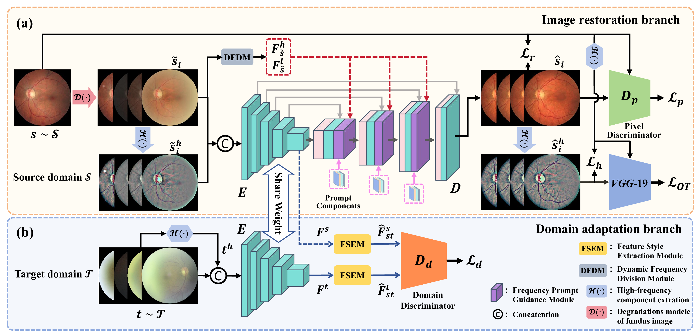
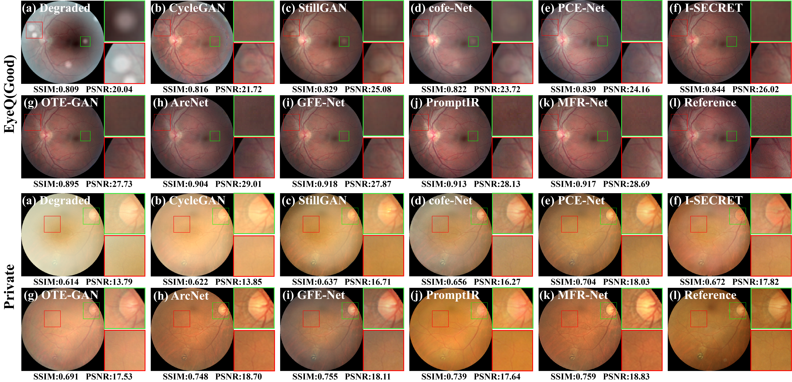
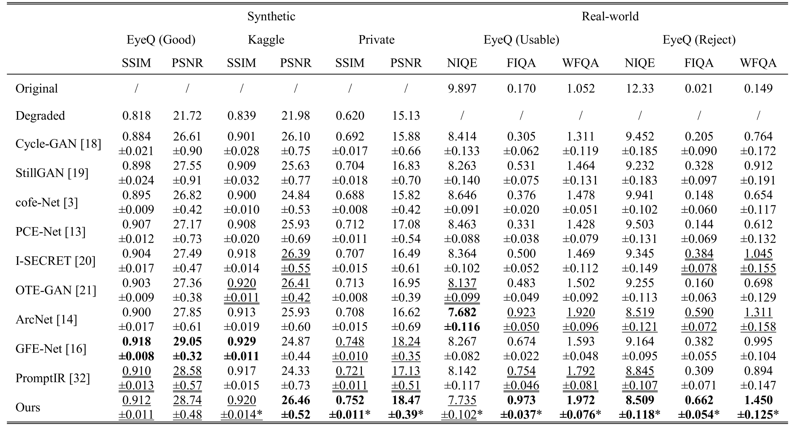

# MFR-Net
Official implementation of the paper "[A Multi-degradation Fundus Image Restoration Network Guided by Frequency Prompt](https://ieeexplore.ieee.org/document/11272904)".


<hr />

> **Abstract:** *High-quality fundus images are critical for clinical diagnosis, yet real-world acquisition challenges often introduce multi-component degradations. Current deep learning methods typically address single degradations, lacking a unified handling of complex scenarios. In this paper, we propose the Multi-degradation Fundus Image Restoration Network (MFR-Net), an all-in-one restoration framework integrating frequency-aware prompt learning. MFR-Net comprehensively extracts the frequency domain features of different degradation components, and injects them into the backbone network through designed prompt generation and interaction modules. Furthermore, to enhance the model's domain generalization capability, the unsupervised domain adaptation is incorporated into a more reliable perceptual and image quality-oriented space for domain alignment. Extensive experimental results demonstrate that the proposed method outperforms several state-of-the-art models in the restoration of degraded retinal images, especially in the restoration of complex degradations in real images, where the quantitative indicators have been improved by up to 5.42% compared with SOTA algorithms.* 

<hr />

## Network Architecture

 


## Quick Start

### 1. Dependencies and Installation
- Python >= 3.8
- CUDA >= 12.0
- Other required packages in `requirements.txt`

```bash
# create new anaconda env
conda create -n mfrnet python=3.10 -y
conda activate mfrnet

# install python dependencies
pip install -r requirements.txt
```

### 2. Dtaset preparation

- Use the script in ```data/pre_process.py```, and modify the ```image_root``` and ```save_root``` to get the images and masks after preprocessing.
- Use the script in ```data/get_low_quality/main_degradation.py``` and modify the image_root to get the ```low_quality_image``` and ```low_quality_mask```.
- By following the steps above, you can create your own dataset. The directory structure is as follows: 

~~~bash
images/
└── [dataset_name]/
    ├── source/
    │   └── AB.jpg
    ├── source_mask/
    │   └── A.png
    ├── target/
    │   └── A.jpg
    └── target_mask/
        └── A.png
~~~

### 3. Train

Ensure that the training data is ready ```images/train``` directory.

Start the Visdom server for training visualization:

```bash
python -m visdom.server
```

Then open http://localhost:8097/ in your browser.

In another terminal, run the following command to start training:

```bash
python train.py --dataroot ./images/train --name MFRNet --model mfrnet --netG ufpro --input_nc 6 --direction AtoB 
--dataset_mode cataract_guide_padding --norm instance --batch_size 8 --gpu_ids 0 --n_epochs 80 --n_epochs_decay 20 --lr 0.0002 --verbose --use_HFC_OT_loss
```

### 4. Test

After preparing the testing data in ```images/test``` directory, place the mode checkpoint file in the ```checkpoints/mfrnet``` directory. To perform the evaluation use: 

```bash
python test.py --dataroot ./images/test --name MFRNet --model mfrnet --netG ufpro --input_nc 6 --direction AtoB 
--dataset_mode cataract_with_mask --norm instance --batch_size 1 --gpu_ids 0 --eval
```

> **Note:** Pretrained checkpoints are not provided due to patient data privacy constraints. Please train the model on your own dataset following the instructions above.


## Results





## Citation

If our code is helpful to your research or projects, please consider citing:

    @article{Han2025AMF,
      title={A Multi-Degradation Fundus Image Restoration Network Guided by Frequency Prompt},
      author={Guang Han and Yaolong Hu and Ning Ding and Shaohua Liu and Linlin Hao and Sam Kwong},
      journal={IEEE Transactions on Medical Imaging},
      year={2025},
      volume={45},
      pages={1817-1831},
      url={https://api.semanticscholar.org/CorpusID:283464885}
    }


## Contact

If you have any questions, please create an issue on this repository or contact at huyaolong66@gmail.com


## Acknowledgements

This code is based on the [ArcNet](https://github.com/liamheng/Annotation-free-Fundus-Image-Enhancement) repositories. 
